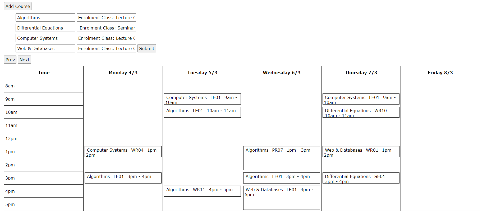

# adelaide-uni-timetable-planner
A basic webapp to generate possible timetable configurations. Try it out [here](https://zanderson004.github.io/adelaide-uni-timetable-planner/).

Instructions:
1. Enter correct year and offshore student checkbox.
2. Find subjects on Access Adelaide Course Planner (e.g. [ADDS](https://access.adelaide.edu.au/courses/details.asp?year=2024&course=107592+1+4410+1)).
3. Choose a suitable name for the course and enter it under the 'Add Course' button.
4. Copy 'Class Details' table and paste into the text box to the right of the course name.
5. Press 'Add Course' and repeat if you wish to enter more subjects.
6. Enter any restrictions where no subjects should be scheduled (more restriction slots can be created with 'Add Restriction').
7. Press submit to keep randomly generating timetables until satisfied.
8. Use 'Prev' and 'Next to view the timetable.

